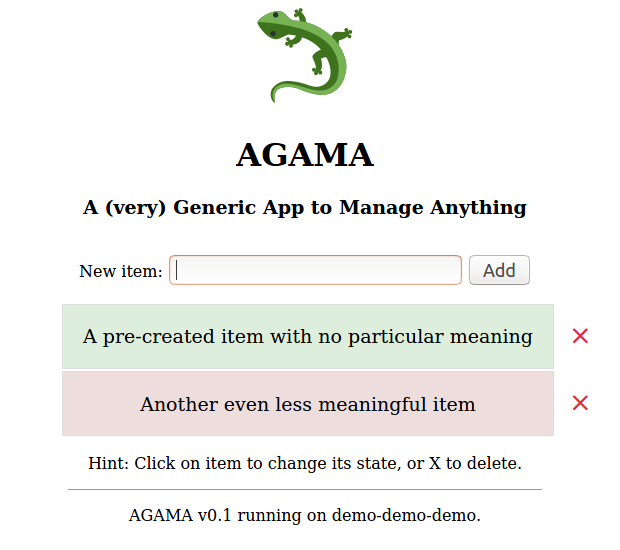

# AGAMA: A (very) Generic App to Manage Anything

Simple (and mostly pointless) list management app in Python, Flask and
SQLAlchemy.

## Purpose

This app is written mainly for demo purposes. It is used to illustrate various
aspects of app _deployment_ (not development) and system administration.

Do not treat this code as an example how to write Flask apps -- you can surely
find some better ones.

## Requirements

 - Python 3 (known to work on v3.6.9)
 - [Flask](https://flask.palletsprojects.com/en/1.1.x/)
   (known to work on v1.1.2)
 - [Flask-SQLAlchemy](https://flask-sqlalchemy.palletsprojects.com/en/2.x/)
   (known to work on v2.4.4)

## Installation

Install dependencies; recommended way is to use system package manager, example
for Debian/Ubuntu:

	apt install python3-flask-sqlalchemy

Alternative way is to use `pip` -- but deploying to Python Virtualenv is
**strongly** recommended in this case:

	/path/to/pip install Flask-SQLAlchemy

Note: do not use both `pip` and `apt`! Choose _one_ method only.

Download the [agama.py](https://raw.githubusercontent.com/hudolejev/agama/master/agama.py)
to the desired location.

That's it -- you're ready to go.

## Configuration

AGAMA is configured with environment variables. Currently the only supported
parameter is `AGAMA_DATABASE_URI` which uses the same format as
[SQLAlchemy database URLs](https://docs.sqlalchemy.org/en/13/core/engines.html#database-urls),
example:

	AGAMA_DATABASE_URI=sqlite:////path/to/db.sqlite3

AGAMA should support all database backends that
[SQLAlchemy supports](https://docs.sqlalchemy.org/en/13/dialects/index.html#included-dialects)
but it was tested only with SQLite and MySQL.

If in doubt, use SQLite -- it's just a demo app after all :)

## Running

Running manually, mostly for development purposes (example for SQLite):

	AGAMA_DATABASE_URI=sqlite:////path/to/db.sqlite3 /path/to/python3 /path/to/agama.py

Running with Systemd (example for MySQL; database, database user and local
system user `agama` should be created first):

	# File: /etc/systemd/system/agama.service
	[Unit]
	Description=AGAMA: A (very) Generic App to Manage Anything

	[Service]
	User=agama
	Environment="AGAMA_DATABASE_URI=mysql://<username>:<password>@<db-host>/<db-name>"
	ExecStart=/path/to/python3 /path/to/agama.py

	[Install]
	WantedBy=multi-user.target

	# Terminal:
	systemctl daemon-reload
	systemctl start agama

You can also run it manually with MySQL backend, or with Systemd and SQLite
backend if you want.

Once started, AGAMA binds to localhost:5000.

Example Nginx proxy configuration:

	server {
		listen 80 default_server;
		server_name _;

		location / {
			proxy_pass http://localhost:5000;
			proxy_set_header Host $http_host;
		}
	}

## Contributing

[Issue reports](./issues) and [pull requests](./pulls) are warmly welcome.

## Author

Juri Hudolejev

## License

MIT
